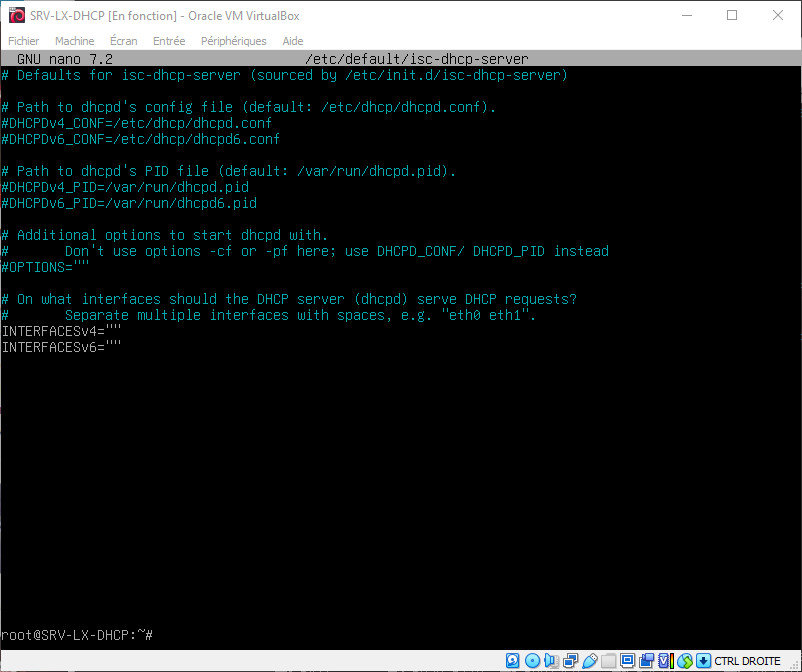
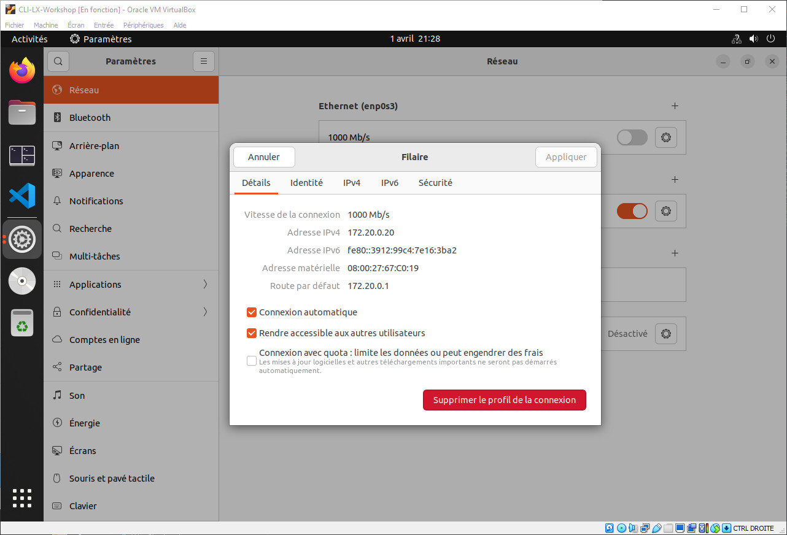

# Installation d'un serveur DHCP sur Linux

Challenge S05 Formation TSSR @ Wild code School - rendu le 01 avril 2024

## Présentation

### Pourquoi ?

Le protocole DHCP (Dynamix Host Configuration Protocol), comme son nom l'indique, fournit un configuration dynamique des adresses IP et des informations associés aux ordinateurs configurés pour l'utiliser (on parle alors de Client DHCP).

Le protocole DHCP offre une configuration du réseau IP fiable et simple, il empêche les conflits d'adresses et permet de contrôler l'utilisation des adresses IP de façon centralisée.

Il permet en outre une économie des adresses et les posts itinérants sont plus faciles à gérer.

Le protocole DHCP repose une attricubtion dynamique des adresses, et répond parfaitement aux besoins de nombreuses entreprises.

### Comment ?

Le principe est simple et se décompose en 4 étapes
* DISCOVER : un Client émet un message de demande de bail IP sur le réseau DHCP
* OFFER : une réponse est envoyé de la part du serveur DHCP, celle-ci comprend une adresse IP avec une durée de bail, ainsi que l'adress IP du serveur
* REQUEST : Lle client accepte la réponse en retour et envoie une demande d'utilisation de cette adresse au serveur DHCP.
* ACK : le serveur DHCP prend en considération cette demande et inscrit le client comme détenteur de l'adresse IP pour la durée du bail qui a été fixé, le client peut alors se connecter au réseau.

## Mise en contexte

Pour notre exemple, nous prendrons des machines virtuelles, le serveur sous Debian (SRV-LX-DHCP), le client sous Ubuntu (CLI-LX-DHCP). Afin d'éviter toutes interférences, nous allons procéder en réseau interne, donc dépourvue de connexion avec l'extérieur.

Bien que le réseau soit interne, nous avons tout de même effectuer les mises à jour disponibles avant désactivation des cartes NAT.

Notre serveur est configuré sur l'adresse IP fixe : 172.20.0.2/24


## Installation du serveur DHCP

Avant toute chose, une petite mise à jour s'impose `apt update && apt upgrade -y`

Nous allons ensuite installer le paquet DHCP sur notre serveur `apt install isc-dhcp-server`

Lorsque l'installation du paquet est terminée, nous devons modifier le fichier du paquet avec la commande `nano /etc/default/isc-dhcp-server` en y ajoutant notre carte réseau comme suit

Avant



Après


Dans notre cas, c'est la carte `enp0s8` configuré en IP fixe qui va servir

Nous allons ensuite modifier le fichier de configuration du paquet avec la commande `nano /etc/dhcp/dhcpd.conf`

Avant


```
# Notre configuration pour le réseau 172.20.0.0
subnet 172.20.0.0 netmask 255.255.0.0 {
range 172.20.0.20 172.20.0.30;
option routers 172.20.0.1;
option broadcast-address 172.20.0.255;
default-lease-time 600;
max-lease-time 7200;
}
```
La première ligne est un commentaire pour indiquer quel réseau nous allons paramètrer
La seconde indique le réseau et son masque
la troisième corerspond à la plage d'IP que le serveur va fournir
La quatrième indique notre passerelle
La cinquième est notre adresse de broadcast
La sixième correspond au bail par défaut (en secondes)
La septième la durée de bail maximum

Il est possible de réserver une adresse IP pour un poste dédié en y intégrant l'adresse MAC du client ciblé

```
host CLI-LX-DHCP {
	 hardware ethernet 08:00:27:1E:17:40;
	 fixed-address 172.20.0.10;
 }
```
Ici, on cible notre Client `CLI-LX-DHCP` grâce à son adresse MAC et on lui attribue l'IP¨`172.20.0.10`


Il est possible de réserver une adresse IP dans la plage (range) créée en y intégrant l'adresse MAC du client ciblé en ajoutant par exemple

```
host CLI-LX-DHCP {
	 hardware ethernet 08:00:27:1E:17:40;
	 fixed-address 172.20.0.10;
 }
```
Enregistrez le fichier modifié afin de conserver vos paramètres, il est temps désormais de redémarrer le service DHCP

```
service isc-dhcp-server restart
```

## Communication avec le Client

Sur le Client, une fois démarré, nous allons activer l'attribution automatique d'IP via DHCP


Désactivez la carte réseau puis réactivez la et vous obtiendrez une adresse IP dans la plage que vous avez créé précédement ou une IP statique fixé par le serveur en lien avec l'adresse MAC de votre carte réseau


Comme vous pouvez le constater, l'IP `172.20.0.10` a été attribué par le serveur via la passerelle, fixé dans la réservation d'IP

Si l'on connecte un second Client, celui-ci se verra automatiquement attribué une IP par le serveur

