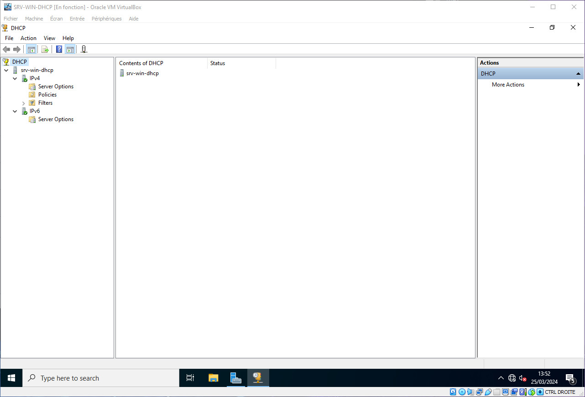

# DHCP avec Windows Server

Challenge S05 Formation TSSR @ Wild Code School - rendu le 25 mars 2024

## DHCP : Pourquoi et comment ?

### Pourquoi ?

Le protocole DHCP (Dynamix Host Configuration Protocol), comme son nom l'indique, fournit un configuration dynamique des adresses IP et des informations associés aux ordinateurs configurés pour l'utiliser (on parle alors de Client DHCP).

Le protocole DHCP offre une configuration du réseau IP fiable et simple, il empêche les conflits d'adresses et permet de contrôler l'utilisation des adresses IP de façon centralisée.

Il permet en outre une économie des adresses et les posts itinérants sont plus faciles à gérer.

Le protocole DHCP repose une attricubtion dynamique des adresses, et répond parfaitement aux besoins de nombreuses entreprises.

### Comment ?

Le principe est simple et se décompose en 4 étapes
* DISCOVER : un Client émet un message de demande de bail IP sur le réseau DHCP
* OFFER : une réponse est envoyé de la part du serveur DHCP, celle-ci comprend une adresse IP avec une durée de bail, ainsi que l'adress IP du serveur
* REQUEST : Lle client accepte la réponse en retour et envoie une demande d'utilisation de cette adresse au serveur DHCP.
* ACK : le serveur DHCP prend en considération cette demande et inscrit le client comme détenteur de l'adresse IP pour la durée du bail qui a été fixé, le client peut alors se connecter au réseau.

## Mise en contexte

Pour notre exemple, nous prendrons des machines virtuelles, le serveur sous Windows Server 2022 (SRV-WIN-DHCP), le client sous Windows 10 Pro (CLI-WIN-DHCP). Afin d'éviter toutes interférences, nous allons procéder en réseau interne, donc dépourvue de connexion avec l'extérieur.

Bien que le réseau soit interne, nous avons tout de même effectuer les mises à jour disponibles avant désactivation des cartes NAT.

Il ne sera pas mentionné la question de DNS et d'Active Directory, nous aborderons ces points dans un autre tutoriel.

NB. Nous travaillerons avec une version de Windows Server en langue US, mais si vous l'utilisez dans une autre langue les options sont identiques, seuls les termes utilisés seront différents.

Notre serveur est configuré sur l'adresse IP fixe : 178.16.10.10/24

## Installation de DHCP sur Windows Server

Il est temps de se rendre sur le Server Manager. En toute logique, celui-ci se lance au démarrage, mais vous pouvez le démarrer via la barre de recherche Windows.

Une fois le Server Manager lancé, rendez-vous sur `Manage` (en haut à droite) puis sélectionnez `Add Roles and Features`

Une fenêtre va s'ouvrir, elle attire votre attention sur certains pré-requis pour continuer
* Le compte administrator doit avoir un mot de passe résistant
* Votre configuration réseau doit être configurée avec un IP fixe
* Les mises à jours de sécurité Windows doivent avoir été faites

Une fois toutes cas tâches validées, vous pouvez cliquer sur `Next`

Choississez ensuite l'otion `Role-based or featured-based installation` puis cliquez sur `Next`

Le serveur étant déjà en local, il est donc déjà selectioné, cliquez sur `Next`

Nous rentrons alors dans le vif du sujet, vous devez ajouter le rôle `DHCP Server`

Une nouvelle fenêtre s'ouvre, assurez-vous d'avoir l'option `Include management tools (if applicable)` cochée, puis cliquez sur `Add Features`

La fenêtre se ferme, le rôle `DHCP Server` est bien coché, cliquez sur `Next`

Dans l'onglet `Features`, laissez comme c'est et cliquez sur `Next`

L'installation du rôle `DHCP Server` est presque terminée, cliquez sur `Next`

Cliquez sur `Install` pour finaliser

Une fois l'installation terminée, cliquez sur `Close`

Votre serveur DHCP est installé, il vous reste désormais à le configurer.

## Configuration de DHCP côté Serveur

Lorsque vous aller sur votre partie DHCP sur le Server Manager, vous pourrez remarquer un bandeau jaune, cliquez sur `More`

Puis cliquez sur `Complete DHCP configuration`

Cliquez sur `Commit`

Puis sur `Close`

Il est préférable après ces étapes de redémarrer le serveur.

Pour procéder à la configuration du serveur DHCP, il vous faudra éxécuter l'application `DHCP` que vous pouvez retrouver via la barre de recherche Windows

Une fois `DHCP` lancé, déroulez, les menus de votre serveur à gauche

A partir de ce menu, en faisant clic-droit sur votre serveur, vous pouvez allez si besoin dans le menu `All Tasks`, ce menu sert à arrêter le serveur, le mettre sur Pause ou le redémarrer, mais là n'est pas le sujet

Nous allons maintenant ajouter une nouvelle étendue sur le serveur DHCP en IPv4, pour ce faire, clic-droit sur `IPv4` pûis `New Scope...` 

Une fenêtre apparait sous forme d'assistant Windows, cliquez sur `Next`

Remplissez les champs `Name` et `Description` puis cliquez sur `Next`

Nous voila dans le vif su sujet, ici, nous allons configurer la plage d'adresses IP qui sera disponible pour les Clients

Remplissez les champs en respectant  sasns que ceux-ci chevauche une autre étendue déjà créée, puis cliquez sur `Next`

Sur la fenêtre suivante, vous pouvez exclure certaines adresses qui pourront être reservés pour des équipements, même si celles-ci font déjà partie d'une étendue, pour se faire, saisissez l'adresse de début de plage et celle de fin de plage, puis cliquez sur `Add`

Puis cliquez sur `Next`

Nous allons ensuite paramétrer la durée du bail, c'est à vous de juger au mieux, suivant l'utilisation qui sera faite de votre pôle d'adresses, cliquez ensuite sur `Next`

Si vous valider les options choisies précédement, sélectionnez `Yes, I want to configure these options now` et cliquez sur `Next`

Nous allons configurer ici l'IP du Routeur qui sert de passerelle entre les Clients et le Serveur

Saisissez l'IP, puis cliquez sur `Add` puis `Next`

Comme dit au début, nous n'utiliserons pas la fonction DNS, étant donné qu'il est inutile sur notre serveur d'avoir une connexion avec l'extérieur

Vous pouvez cliquez sur `Next`

Il en est de même pour la partie WINS, cliquez sur `Next`

Sélectionnez l'option `Yes, I want ton activate this scope now`` puis cliquez sur `Next`

Finalisez la configuration en cliquant sur `Finish`

L'étendue que vous venez de configurer apparait alors dans les paramètres IPv4

La configuration est terminée, nous allons voir maintenant comment se déroule l'échange avec le Client

## Echange avec le Client Windows 10 Pro

Sur le client, rendez-vous dans le centre Réseau et partage, assurez-vous que l'adressage IPv4 est en `Automatique`

La connexion au serveur DHCP va s'établir et une adresse va être attribuer au Client, ici 178.16.10.69, qui correspond bien à l'étendue créée précédement

Vous pourrez alors vous rendre compte de la date d'obtention du bail, ainsi que la date d'expiration, il est également indiqué l'IP du serveur DHCP

Il est possible aussi de voir ceci dans en ouvrant Powershel et en tapant la commande `ipconfig`

## Vérification du bon fonctionnement côté serveur

De retour sur le serveur, vous pouvez vérifier dans l'application `DHCP` puis `IPv4` puis |`Adress Leases` que le Client a bien obtenu une IP

Windows conserve également un fichier de log dans `C:\Windows\System32\dhcp`

Les logs sont libellés avec le jour, dans notre cas `DhcpSrvLog-Mon.txt`

En consultant le fichier, on peut s'apercevoir que notre Client CLI-WIN-DHCP a bien reçu l'IP 178.16.10.69

Vous pouvez à tout moment supprimer cette autorisation, tout comme le Client peut libérer l'IP en lançant la commande `ipconfig /release` dans Powershell