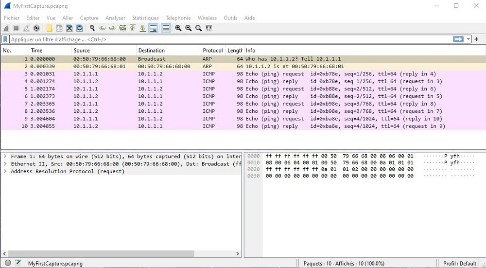
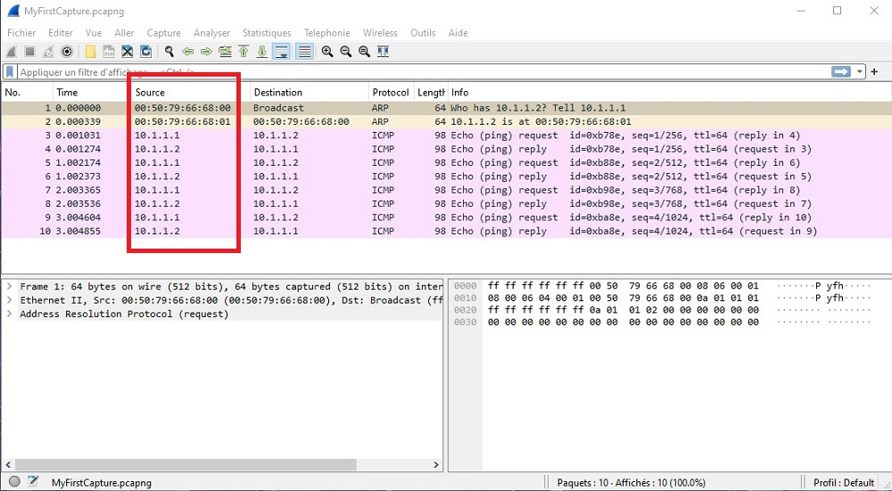
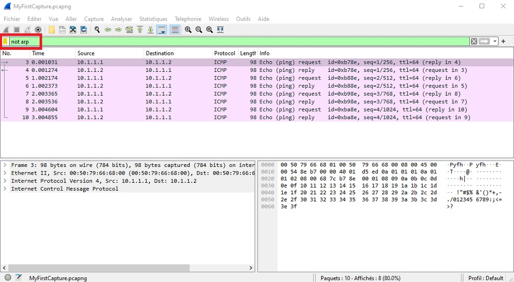
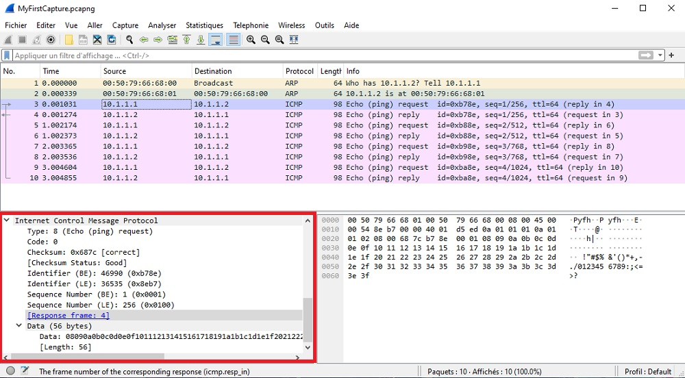
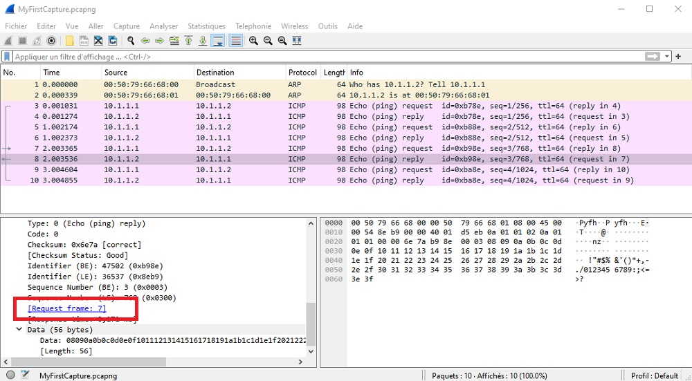

# Installation de Wireshark et analyses des trames ethernet

Challenge S04 Formation TSSR @ Wild Code School - rendu le 17 mars 2024

## Contexte

A partir de  [MyFirstCapture.pcapng](https://github.com/WildCodeSchool/TSSR_Resources/raw/main/pcap/MyFirstCapture.pcapng), répondez aux questions suivantes.

**1. Quels protocoles ont été utilisés dans la trace réseau capturée ? Indique comment tu as eu cette information (quelle fenêtre, éventuellement quelle ligne ou quelle colonne).**

Les protocoles utilisés dans la trace réseau sont accessibles en regardant disponibles dans la fenêtre de liste des paquets, en 5ème colonne.

* Protocole ARP
* Protocole ICMP

**2. Quelles sont les adresses IP et les adresses MAC des interfaces ayant échangé des informations ?**

Les adresses IP et MAC des interfaces ayant échangé les informations sont accessibles en regardant la fenêtre de loste des paquets, en 3ème colonne

* 00:50:79:66:68:00 _Adresse MAC_
* 00:50:79:66:68:01 _Adresse MAC_
* 10.1.1.1 _IP_
* 10.1.1.2 _IP_

**3. Quel filtre d'affichage permet de ne plus afficher les paquets ARP ?**

Le filtre d'affichage qui permet de ne pas afficher les paquets ARP est :

* not arp

**4. Quelles informations sont disponibles dans la colonne info de la liste des paquets pour la ligne 3 ?**

A partir des information contenues dans la fenêtre de détail des paquets, on peut apprendre que :

* Echo (ping) request : c'est une demande de requête ping
* id=0xb78e correspond à Identifier (BE) : 46990
* seq=1/256 correspond aux Sequence Number BE & LE
 
**5. Le paquet N°8 est-il une question ou une réponse ? et quel est le paquet correspondant (la question, si c'est une réponse ou la réponse, si c'est une question) ?**

Le paquet est une réponse à la requête de ping de la ligne 7
